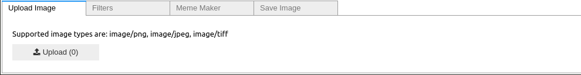
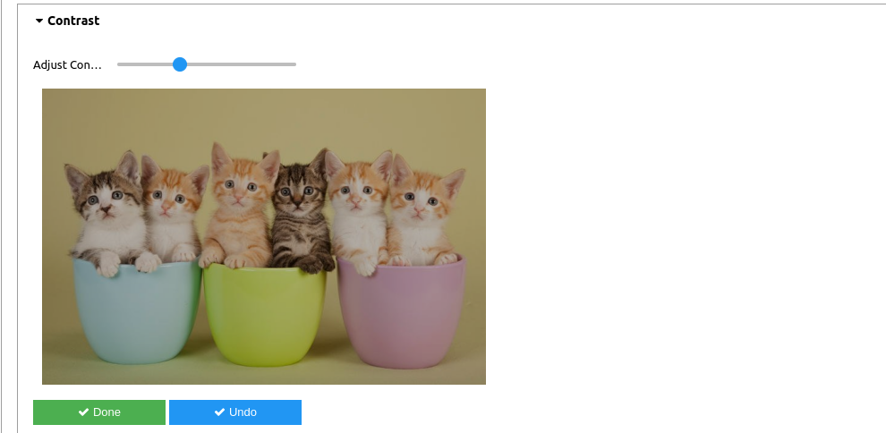
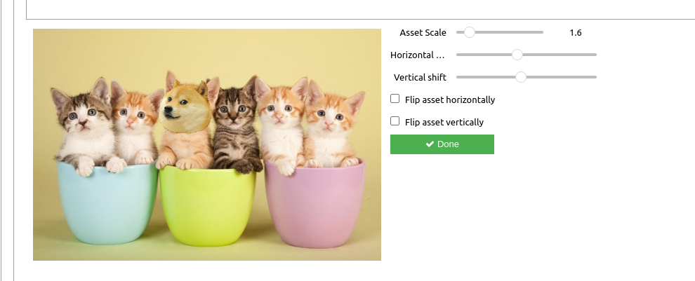

# CE352 (Image Processing) Semester Project

Description: Development of a portrait-editing application that can be used to create memes.

## Install prerequisites
Create a new anaconda environment

```
conda create -n project_env python=3.11
```

Activate the environment with
```
conda activate project_env
```

To install the dependences, cd into the project directory and run
```
pip install -r requirements.txt
```

I run the jupyter notebook in VS Code
- Run `jupyter notebook --no-browser` when in project_env environment
- In VS Code, click on `Select Kernel` > `Select Another Kernel` > `Existing Jupyter Server` and paste the jupyter link
- Select the Python3 kernel and click `Run All`

## Graphical User Interface (GUI)
The project uses ipywidgets to create a very simple Graphic User Interface for the user to interact. There are 4 tabs:



**Upload Image**: By clicking upload, a window pops up and you can select an image with one of the supported types. If the image type is not supported, the application
prompts you to upload another image.

**Filters**: In filters tab, you can choose from a multiple of filters to apply to the image. The degree to which a filter is applied is controlled by sliders


By clicking **Done**, the changes you made to this image regarding a particular image are registered and the image is updated. **Undo** will bring the image back to the state the image was after the last **Done** was pressed or the original if no changes were made.

**Meme Maker**: In the meme maker tab, you can add meme attributes, glasses or hats. At first, an image with all the detected faces or eyes is shown. Then you must select the face/eyes you want to add the meme attribute to and then the meme attribute. After you have chosen both of them, the attribute is placed in a position deemed appropriate. You can change the scale and the position of the attribute, as well as flip it horizontally or vertically, using the controls (sliders and checkers). To add multiple objects, click `Done` everytime you are satisfied with an object added and then select another face and/or object. 



**Save Image**: You can type the name by which the image will be saved and then the new edited image, will be saved in **jpeg** format in the folder Images

## File structure

- project.ipynb: the main notebook file
- bilateralFilter.pyx: a Cython Implementation to speed up bilateralFilter
- color_model.py: transforms rgb images to hsv/hls color space and back
- config.py: configuration file
- eyes_detections.py: used to detect eyes and draw bounding boxes
- face_detection.py: used to detect face and draw bounding boxes
- filters.py: file that has the functions for the filters
- layout.py: contains all layouts, buttons or handlers
- meme_maker.py: contains the functions that adds the meme assets to images
- requirements.txt
- setup.py: function for cython compilation
- haarcascades: Haarcascades for face recognition
- docs: images for README.md
- assets: transparent background assets
- Images: where the edited images are stored
- Original_Images: some images used for examples
